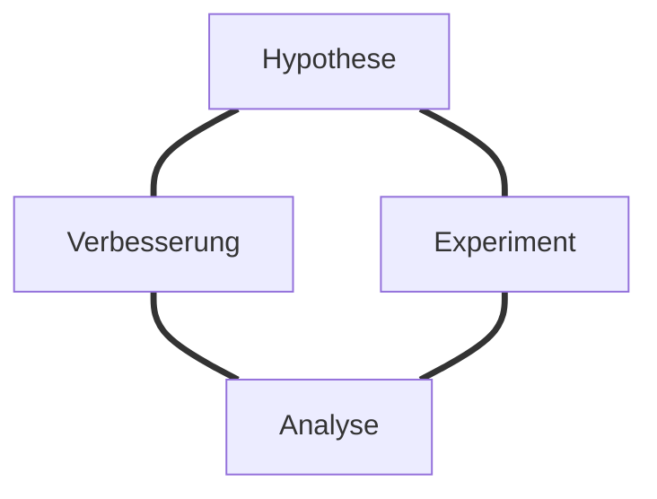
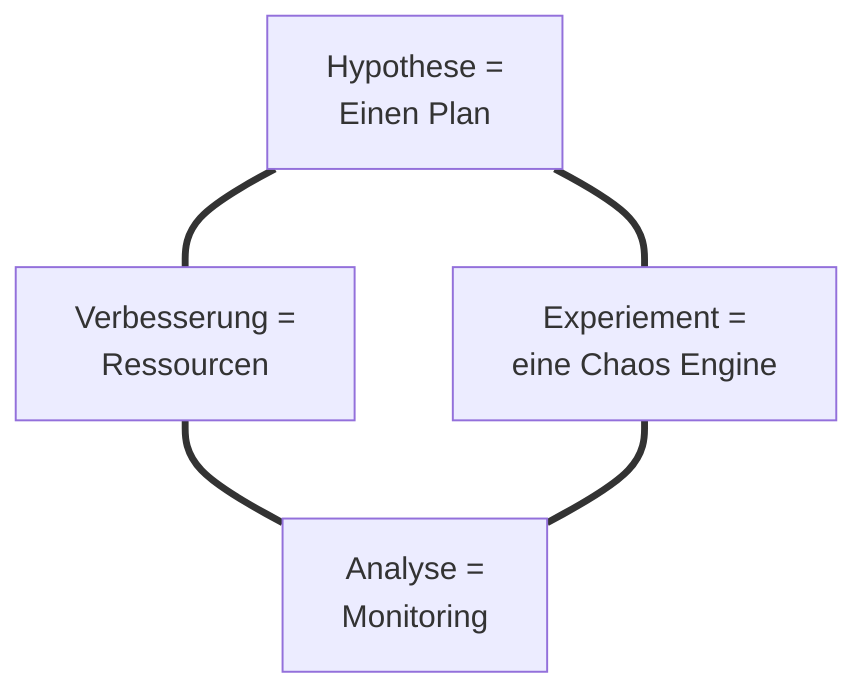

---
# try also 'default' to start simple
theme: dracula
# random image from a curated Unsplash collection by Anthony
# like them? see https://unsplash.com/collections/94734566/slidev
background: /Chaos.jpg
# some information about your slides, markdown enabled
title: Chaos Engineering
layout: cover
---

# Bring ein bisschen Chaos in die Ordnung!

Chaos Engineering mit Chaos Mesh in Kubernetes
---
layout: author
---

# Tobias Richling

Teamleiter Digital Operations @ apetito AG
Passionate about .NET, Docker, Kubernetes and Software Architecture

<footer >

<iconoir-twitter /> [@trichling](https://twitter.com/trichling)
<iconoir-github /> [trichling](https://github.com/trichling)
<iconoir-mail /> [tobias.richling@apetito.de](mailto:tobias.richling@apetito.de)

</footer>

---
layout: image-right
image: /Chaos.jpg
---
# Agenda

- Ja wieso denn bloß?

- Was ist Chaos Engineering

- Chaos Engineering mit Chaos Mesh
    - Installation
    - Chaos Experimente
    - Schedules
    - Workflows

- Dev, Stage, Prod?

- Fazit und Ausblick

---
layout: section
---

# Ja wieso denn bloß?

---
layout: image-left
image: /Fallacies.jpg
---

# Fallacies of distributed computing 

1. The network is reliable. (Das Netzwerk ist ausfallsicher.)
2. There is zero latency. (Die Latenzzeit ist gleich null.)
3. Bandwidth is infinite. (Der Datendurchsatz ist unbegrenzt.)
4. The network is secure. (Das Netzwerk ist sicher.)
5. Topology never changes. (Die Netzwerktopologie ist stabil.)
6. There is one admin. (Es gibt nur einen Administrator.)
7. Transport cost is zero. (Der Datentransports kostet nichts.)
8. The network is   homogeneous. (Das Netzwerk ist homogen.)

[Quelle: Wikipedia](https://en.wikipedia.org/wiki/Fallacies_of_distributed_computing)

---
layout: section
---

# Was ist Chaos Engineering

---
layout: quote
---

# Chaos Engineering is the discipline of experimenting on a system in order to build confidence in the system’s capability to withstand turbulent conditions in production.

[Quelle: Principle of chaos engineering](https://principlesofchaos.org/)

---

# Prozess des Chaos Engineering

---

# Was braucht man für Chaos Engineering

---
layout: statement
---

# Welche Möglichkeiten gibt es denn, ein bisschen Chaos zu erzeugen?

<v-click>
Gibt es da auch was von der Stange?
</v-click>

---
layout: image-right
image: /ChaosEngine.jpg
---

# Ein paar Chaos Engines...

- [Chaos Monkey](https://github.com/Netflix/chaosmonkey?tab=readme-ov-file)
    - entwickelt von Netflix
    - erfordert Spinnaker und eine MySQL Datenbank
- [Azure Chaos Studio](https://learn.microsoft.com/en-us/azure/chaos-studio/chaos-studio-overview)
    - CAAS (Chaos as a Service)
    - Erfordert eine Azure Subscription
- [Gremlin ](https://www.gremlin.com/)
    - CAAS (Chaos as a Service)
    - Cloud-Unabhängig
- [Chaos Mesh](https://chaos-mesh.org/) / [Litmus](https://litmuschaos.io/)
    - Kostenlos
    - Open Source

---

# Chaos-Mesh

<v-clicks>

- Chaos-Mesh ist eine cloud-native Chaos Engineering Plattform, die Chaos in Kubernetes-Umgebungen orchestriert.

- Chaos-Mesh wurde im Juli 2020 von der CNCF akzeptiert.

- Chaos-Mesh erreichte im Februar 2022 den Reifegrad "Incubating".

- Es ermöglicht das Injizieren von Fehlern in Kubernetes-Anwendungen, um die Widerstandsfähigkeit des Systems zu testen.

- Es ist einfach zu bedienen und bietet eine Web-Benutzeroberfläche zur Konfiguration und Verwaltung der Chaos-Experimente.

- Chaos-Experimente können sowohl als Kubernetes CRDs als auch über die Web-Benutzeroberfläche eingereicht werden.

</v-clicks>

---
layout: section
---

# Chaos Experimente!

---
layout: section
---

# Dev, Stage, Prod
Chaos Engineering in verschiedenen Umgebungen

---
layout: quote
---

# To guarantee both authenticity of the way in which the system is exercised and relevance to the current deployed system, Chaos strongly prefers to experiment directly on production traffic.

[Quelle: Principle of chaos engineering](https://principlesofchaos.org/)

---
layout: quote
---

# Experimenting in production has the potential to cause unnecessary customer pain. [...], it is the responsibility and obligation of the Chaos Engineer to ensure the fallout [...] are minimized and contained.

[Quelle: Principle of chaos engineering](https://principlesofchaos.org/)

---
# Ideen zum Umgang mit Chaos-Experimenten im Proudktivsystem

<v-clicks>

- Experimente zunächst in einer Testumgebung durchführen (klare Hypothese / Monitoring).

- Klare Beschränkung auf eng eingegrenzte Bereich (Blast-Radius).

- Klare Kommunikation innerhalb des Unterenhmens (interne Ankündigung).

- Den Kunden ein Wartung ankündigen, in der es zu Einschränkugen kommen kann (nicht zu oft).

- A/B Testing, Load Balancing auf einem parallelen System um nicht alle Kunden zu betreffen.

</v-clicks>
---
background: /Chaos.jpg
---

# Fazit

<v-clicks>

- Chaos Engineering leistet einen wichtigen Beitrag zur Entwicklung resilienter verteilter Systeme.

- Ohne gutes Monitoring und eine klare Hypothese sind Chaos Experimente wenig hilfreich.

- Chaos Mesh ist eine einfach zu bedienende und mächtige Chaos Engine für Kubernetes.

- Die Installation ist einfach weil es keine Abhängigkeiten gibt.

- Die Experimente sind einfach als Kubernetes Manifeste zu konfigurieren.

- Chaos Experimtente können in der Version Control verwaltet werden.

- Für weiterführende Experimente in mehreren Clustern oder mit mehreren Beteiligten wird Chaos Mesh irgendwann zu klein.

</v-clicks>

---
background: /ChaosFazit.jpg
# some information about your slides, markdown enabled
title: Chaos Engineering
layout: cover
---

# Vielen Dank für die Aufmerksamkeit!

Habt ihr noch Fragen?

<iconoir-twitter /> [@trichling](https://twitter.com/trichling)   · 

<iconoir-github /> [trichling](https://github.com/trichling) ·  

<iconoir-mail /> [tobias.richling@apetito.de](mailto:tobias.richling@apetito.de)

