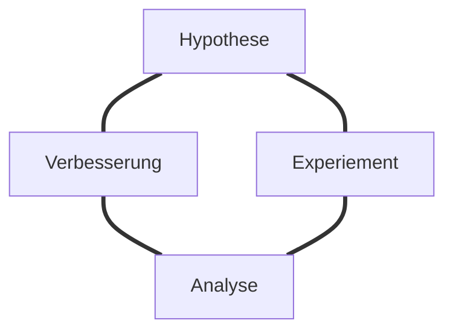
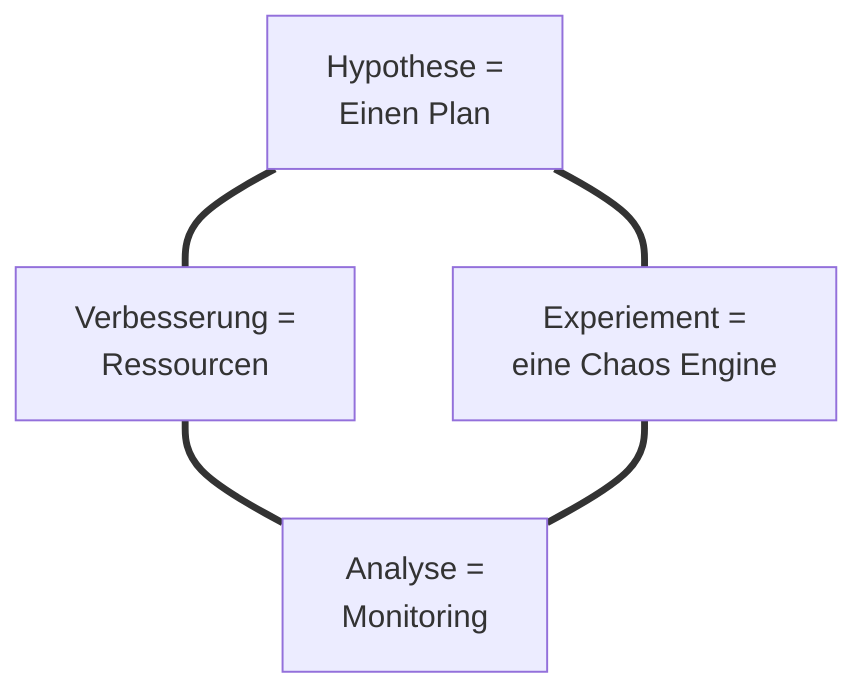

---
# try also 'default' to start simple
theme: dracula
# random image from a curated Unsplash collection by Anthony
# like them? see https://unsplash.com/collections/94734566/slidev
background: /Chaos.jpg
# some information about your slides, markdown enabled
title: Chaos Engineering
layout: cover
---

# Bring ein bisschen Chaos in die Ordnung!

Chaos Engineering mit Chaos Mesh
---
layout: author
---

# Tobias Richling

Teamleiter Digital Operations @ apetito AG
Passionate about .NET, Docker, Kubernetes and Softwere Architecture

<footer >

<iconoir-twitter /> [@trichling](https://twitter.com/trichling)
<iconoir-github /> [trichling](https://github.com/trichling)
<iconoir-mail /> [tobias.richling@apetito.de](mailto:tobias.richling@apetito.de)

</footer>

---
layout: image-right
image: /Chaos.jpg
---
# Agenda

- Was ist Chaos Engineering

- Chaos Engineering mit Chaos Mesh
    - Installation
    - Chaos Experimente
    - Schedules
    - Workflows

- Fazit und Ausblick

---
layout: section
---

# Was ist Chaos Engineering

---
layout: quote
---

# Chaos Engineering is the discipline of experimenting on a system in order to build confidence in the system’s capability to withstand turbulent conditions in production.

[Quelle: Principle of chaos engineering](https://principlesofchaos.org/)

---

# Prozess des Chaos Engineering

---

# Was braucht man für Chaos Engineering

---
layout: image-right
image: /ChaosEngine.jpg
---

# Ein paar Chaos Engines...

- [Chaos Monkey](https://github.com/Netflix/chaosmonkey?tab=readme-ov-file)
    - entwickelt von Netflix
    - erfordert Spinnaker und eine MySQL Datenbank
- [Azure Chaos Studio](https://learn.microsoft.com/en-us/azure/chaos-studio/chaos-studio-overview)
    - CAAS (Chaos as a Service)
    - Erfordert eine Azure Subscription
- [Gremlin ](https://www.gremlin.com/)
    - CAAS (Chaos as a Service)
    - Cloud-Unabhängig
- [Chaos Mesh](https://chaos-mesh.org/)
    - Kostenlos
    - Open Source

---

# Chaos-Mesh

- Chaos-Mesh is a cloud-native Chaos Engineering platform that orchestrates chaos on Kubernetes environments.

- Chaos-Mesh was accepted by the CNCF in July 2020.

- Chaos-Mesh reached the Incubating maturity level in February 2022.

- It allows to inject faults to Kubernetes applications in order to test the resiliency of the system.

- It is easy to use, and it provides a web UI to configure and manage the chaos experiments.

- Chaos Experiments can be submitted as Kubernetes CRDs as well as via the Web UI.

---
layout: section
---

# Chaos Experimente!!

---

# Fazit

<v-clicks>

- Chaos Engineering leistet eine wichtigen Beitrag zur Entwicklung resilienter verteilter Systeme.

- Ohne gutes Monitoring und eine klare Hypothese sind Chaos Experimente wenig hilfreich.

- Chaos Mesh ist eine einfach zu bedienende und mächtige Chaos Engine für Kubernetes.

- Die Installation ist einfach weil es keine Abhängigkeiten gibt.

- Die Experimente sind einfach als Kubernetes Manifeste zu konfigurieren.

- Chaos Experimtente können in der Version Control verwaltet werden.

- Für weiterführende Experimente in mehreren Clustern oder mit mehreren Beteiligten wird Chaos Mesh irgendwann zu klein.

</v-clicks>

---
background: /Chaos.jpg
# some information about your slides, markdown enabled
title: Chaos Engineering
layout: cover
---

# Vielen Dank für die Aufmerksamkeit!

Habt ihr noch Fragen?

<iconoir-twitter /> [@trichling](https://twitter.com/trichling)   · 

<iconoir-github /> [trichling](https://github.com/trichling) ·  

<iconoir-mail /> [tobias.richling@apetito.de](mailto:tobias.richling@apetito.de)

